# インフラ構成図

## 全体システム構成図

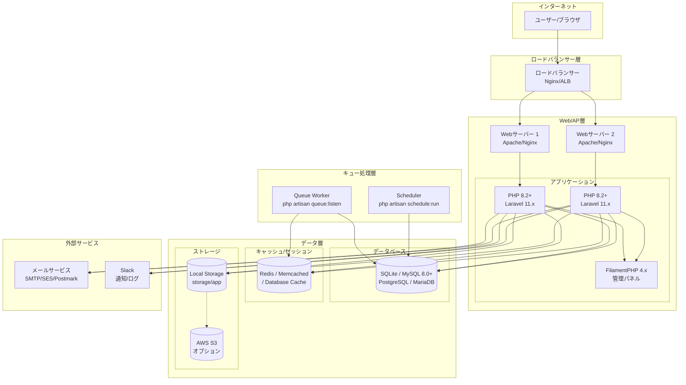

## レイヤー別構成図

### アプリケーション層詳細

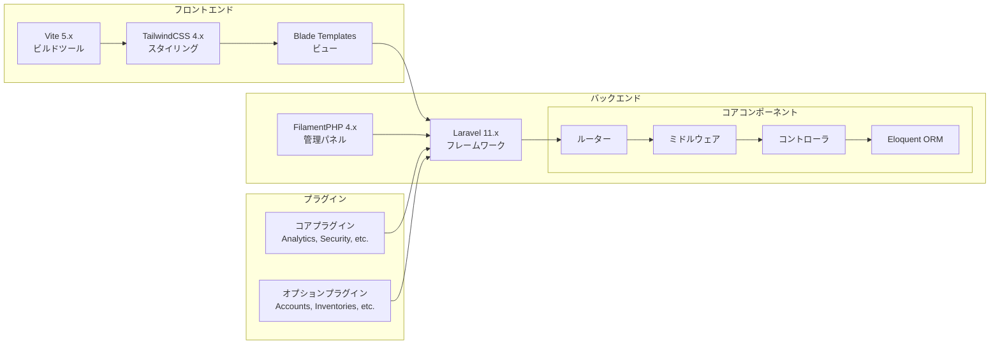

### データフロー図

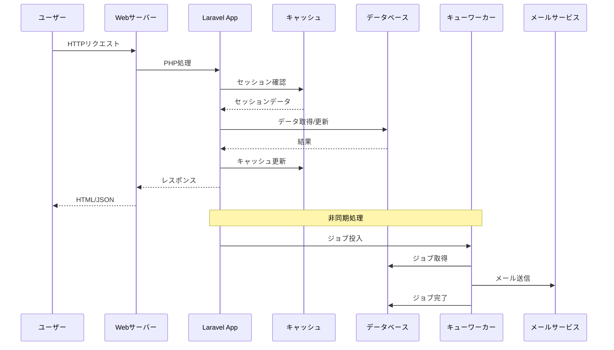

## データベース接続構成

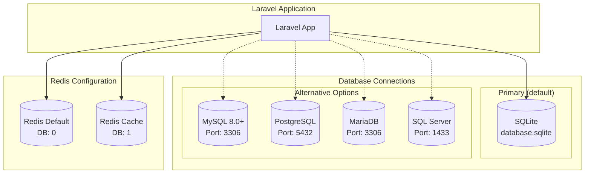

## キャッシュ/セッション/キュー構成

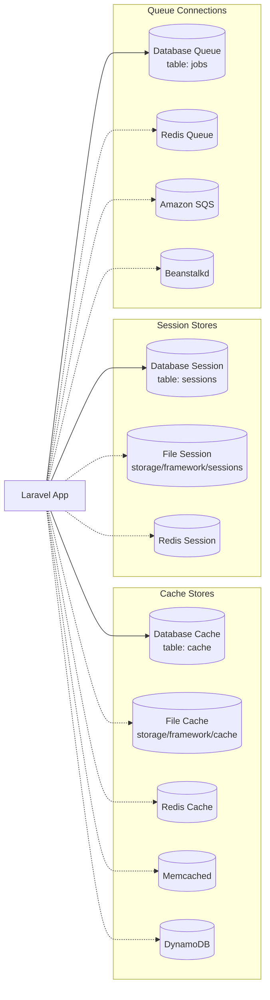

## ファイルストレージ構成

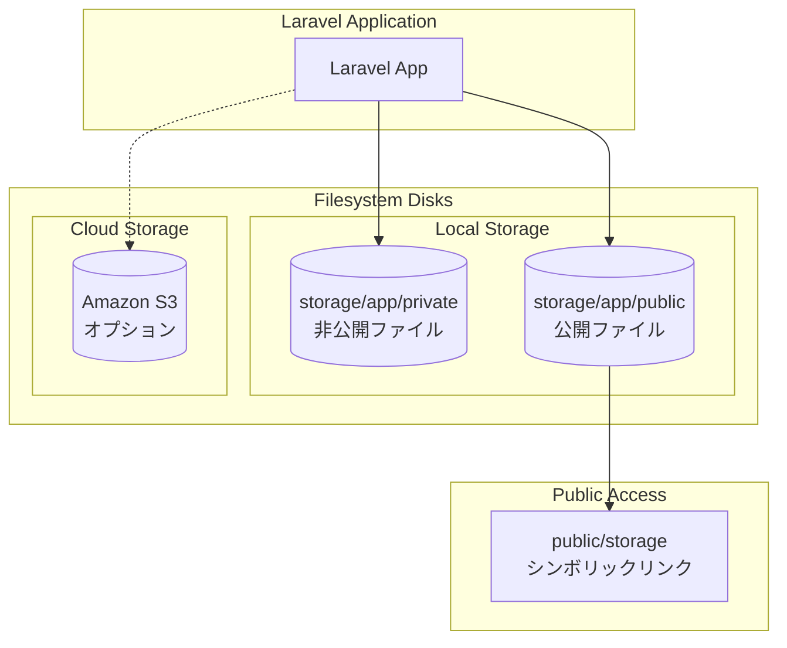

## メール送信構成

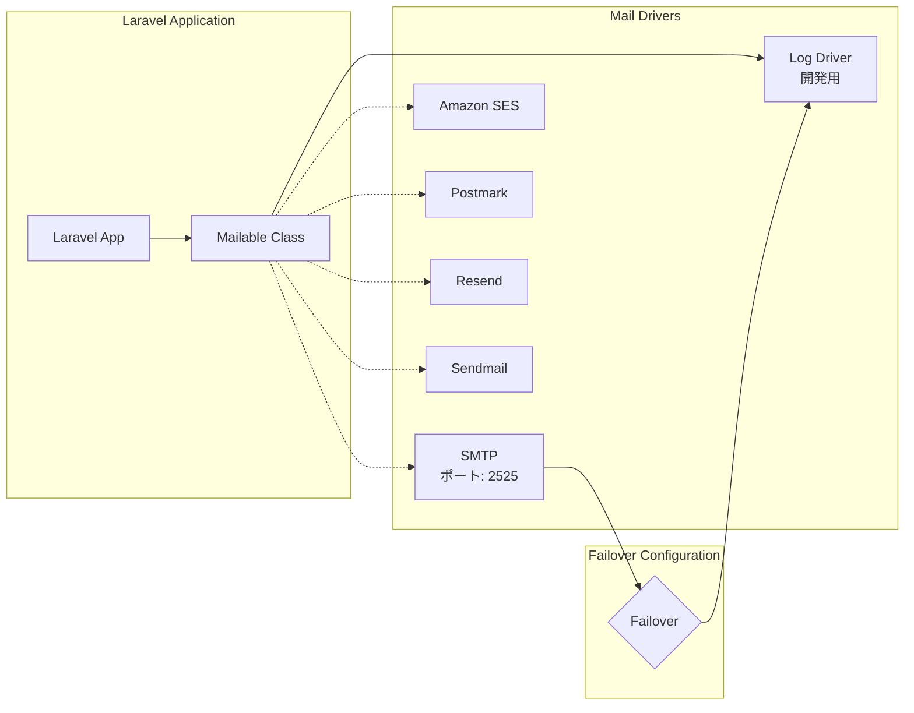

## ログ収集構成

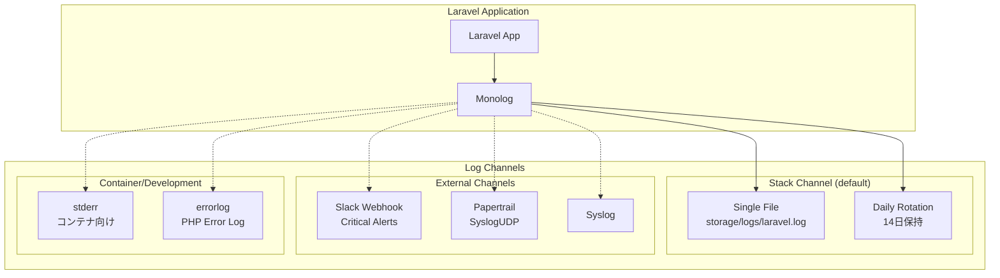

## プラグインアーキテクチャ

```mermaid
graph TB
    subgraph "AureusERP Core"
        LARAVEL[Laravel 11.x]
        FILAMENT[FilamentPHP 4.x]
    end

    subgraph "Core Plugins (システムプラグイン)"
        ANALYTICS[Analytics<br/>BI・レポート]
        CHATTER[Chatter<br/>内部コミュニケーション]
        FIELDS[Fields<br/>カスタムフィールド]
        SECURITY[Security<br/>認証・認可]
        SUPPORT[Support<br/>ヘルプデスク]
        TABLE_VIEWS[Table Views<br/>データ表示]
    end

    subgraph "Installable Plugins (オプション)"
        subgraph "財務系"
            ACCOUNTS[Accounts]
            INVOICES[Invoices]
            PAYMENTS[Payments]
        end

        subgraph "販売・購買系"
            SALES[Sales]
            PURCHASES[Purchases]
            PRODUCTS[Products]
        end

        subgraph "人事系"
            EMPLOYEES[Employees]
            RECRUITMENTS[Recruitments]
            TIME_OFF[Time-off]
            TIMESHEETS[Timesheets]
        end

        subgraph "その他"
            CONTACTS[Contacts]
            PARTNERS[Partners]
            INVENTORIES[Inventories]
            PROJECTS[Projects]
            BLOGS[Blogs]
            WEBSITE[Website]
        end
    end

    LARAVEL --> FILAMENT
    FILAMENT --> ANALYTICS
    FILAMENT --> CHATTER
    FILAMENT --> FIELDS
    FILAMENT --> SECURITY
    FILAMENT --> SUPPORT
    FILAMENT --> TABLE_VIEWS

    FILAMENT -.-> ACCOUNTS
    FILAMENT -.-> INVOICES
    FILAMENT -.-> PAYMENTS
    FILAMENT -.-> SALES
    FILAMENT -.-> PURCHASES
    FILAMENT -.-> PRODUCTS
    FILAMENT -.-> EMPLOYEES
    FILAMENT -.-> RECRUITMENTS
    FILAMENT -.-> TIME_OFF
    FILAMENT -.-> TIMESHEETS
    FILAMENT -.-> CONTACTS
    FILAMENT -.-> PARTNERS
    FILAMENT -.-> INVENTORIES
    FILAMENT -.-> PROJECTS
    FILAMENT -.-> BLOGS
    FILAMENT -.-> WEBSITE
```

## 本番環境推奨構成

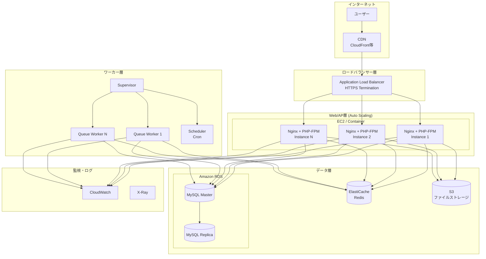

## 開発環境構成

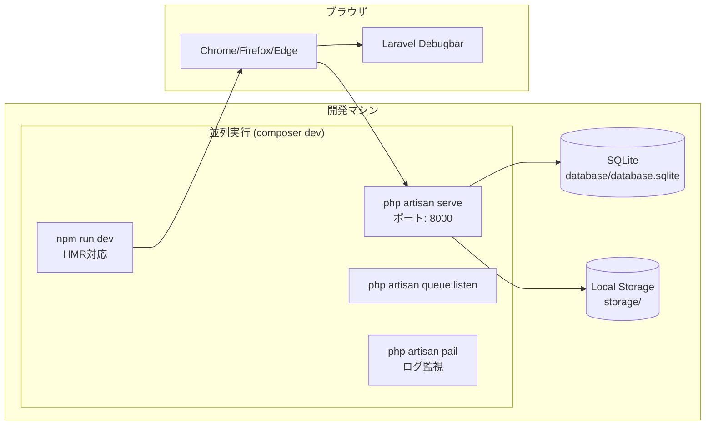
